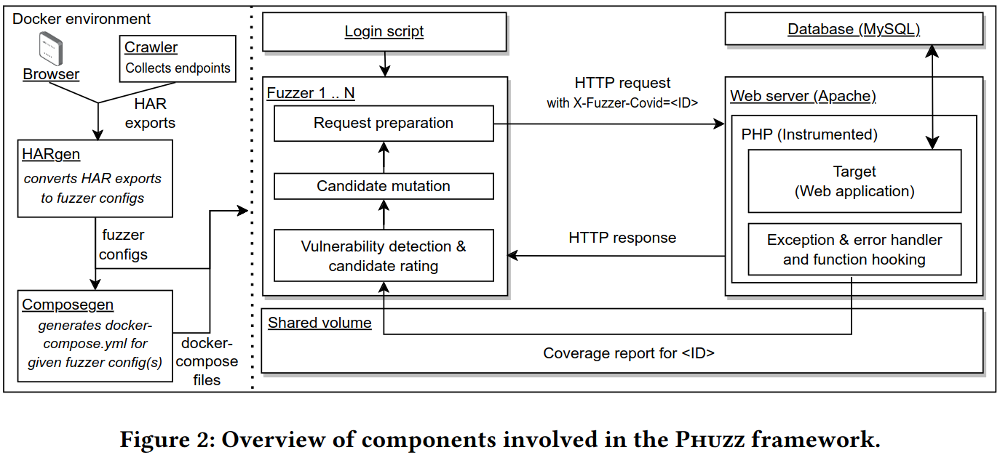
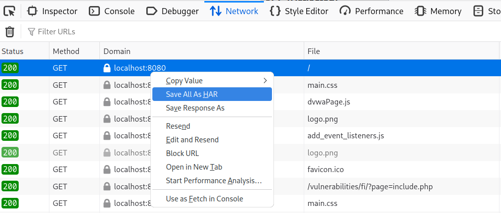
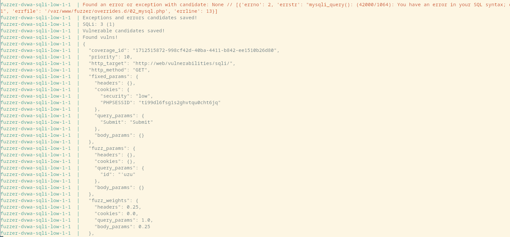

PHUZZ
========================



## Requirements

To run PHUZZ, you will need to have a working Docker [1] environment and the Docker-compose [2] extension. 
As far as possible, we have pinned the containers to specific image version to always build against the same version of packages, etc.

## Components

As shown in the above figure, PHUZZ consists of several components to facilitate the fuzzing process. Each component has a separate README with more details.

The following components are supposed to facilitate the use of PHUZZ, especially the generation of configuration files. However, it is also possible to manually create a new configuration file and then edit the existing `docker-compose.yml` to run PHUZZ with it.

### Manual HAR export

We argue that crawlers might not always find all endpoints that one would like fuzz. Thus, we implement a more natural way to provide endpoints to PHUZZ using a manual approach. Further, this allows more control over which parts of a (complex) application will be fuzzed. 

After the starting the web application in the `web` container, navigate to the web application at `http://localhost:8080/`. Open the development tools in the browser of your choice (e.g. Chrome or Firefox). Use the web application as thorough as possible to capture as many endpoints in the `Network` tab as possible. Now right click and choose `Save all as HAR` to export all requests as seen on the screenshot below:



This file can now be passed to the `HARgen` component which will generate PHUZZ configuration files for the captured endpoints.

### Crawler

Alternative, PHUZZ also features a very basic crawling component based on a headless Chrome browser that is instrumented using the playwright library to collect endpoints from a web application. 

After starting the `web` container with the web application, start the crawler as described in `./crawler/`. The result will be an exported `output.har` file, which can then be passed to the HARgen component. 

### HARgen

This component is used to generate configuration files for PHUZZ from the HTTP requests in a provided HAR file. The HARgen tool provides a large variety of filtering options to select only specific endpoints that should be fuzzed. 

See `./hargen/` on how to use the converter.

### Configs

The output of the HARgen tool are a set of JSON-based configuration files that can be passed to PHUZZ or the other blackbox tools in our docker containers.

Each configuration file represents an endpoint of the target application, e.g. the URL, the parameters (headers, cookies, query, body), request method, and other options. PHUZZ loads this file to generate the initial (seed) HTTP requests to send to the target application and use as basis for the mutations. 

See `./configs/` for examples and what configuration options exist.

### Composegen

The Composegen component can be used to create a `docker-compose.yml` file based on single or a set of PHUZZ configuration files, e.g. to run multiple instances of PHUZZ against a single endpoint or multiple endpoints.

See `./composegen/` on how to use this tool.

### Login script

The `fuzzer/automated_logins/` folder contains python scripts that can be used to perform initial interactions with the target application before the actual fuzzing process begings, e.g. to obtain a valid session or configure the application to reach a certain state.

See `./fuzzer/automated_logins/` for more details, but in theory, the same can usually be achieved using function overrides and hooks.

### Web server / Database / Instrumentation

PHUZZ comes with a `db` container that contains a MySQL server. If the web application requires a different database, add a new container definition to the `docker-compose.yml` and adjust the `web` container definition.

The fuzzed web application has to run in the `web` container. See `./fuzzer/` for how to add a new web application. By default, this repo comes with DVWA, XVWA, bWAPP, WackoPicko, WordPress and a testsuite. 

The web container environment comes with the following configuration options:
```
APPLICATION_TYPE: dvwa
FUZZER_COVERAGE_PATH: /var/www/html/
FUZZER_COMPRESS: 1
REQUIRES_DB: 1
WP_TARGET_PLUGIN: show-all-comments-in-one-page
```

The option `APPLICATION_TYPE` defines the (folder) name of the web application in `web/applications/`. `FUZZER_COVERAGE_PATH` is a filter for the coverage collection to limit what files should be monitored, which can have an impact on the coverage collection's impact.
`FUZZER_COMPRESS` enables or disables the GZip compression of the collected coverage information, e.g. to save (disk) space and maybe increase the performance. This value has to be the same in the fuzzer's environment.
Last, `REQUIRES_DB` enables a wait-loop for the database container, so that the web container does not try to configure the web application before the database is ready.

For the WordPress application, the option `WP_TARGET_PLUGIN` defines which plugin should be automatically installed. The plugin has to exist in the `./web/applications/wordpress/_plugins/` folder as a zip file. 


### Fuzzer 
The fuzzer component can also be configured with several environment options.

```
FUZZER_CONFIG: dvwa/sqli_fuzz
FUZZER_NODE_ID: 1
FUZZER_CLEANUP: 1
FUZZER_COMPRESS: 1
```

Most important is `FUZZER_CONFIG` which defines what configuration file should be loaded by the fuzzer. `FUZZER_NODE_ID` is used for parallel fuzzing and coordination/synchronization between multiple fuzzers. `FUZZER_CLEANUP` instructs the browser to delete processed coverage information from the shared filesystem. As explained before, `FUZZER_COMPRESS` indicates to the fuzzer that the coverage information is GZip compressed. 

Furthermore, `FUZZER_SEED` can be set to initialize python's `random.seed` function with a specific seed, e.g. to always generate the same mutations. 

## Usage

Usually, three docker containers need to be started to run the fuzzer: The database, the webserver and the fuzzer. 

We suggest to use tmux [3] to have three shells next to each other.


### Database

Usually, web applications require a database to function. Thus, PHUZZ comes with a MySQL database container named `db`.

This one should be started first with `docker-compose up db --force-recreate`. Then wait for mysqld to finish the initialization as indicated by the following line:

`db-1  | Version: '5.7.42'  socket: '/var/run/mysqld/mysqld.sock'  port: 3306  MySQL Community Server (GPL)`

### Webserver

Next, start the `web` container to bring up the web application with `docker-compose up web --build --force-recreate`. Wait for the initialization of the web server as indicated by `web-1  | [Sun Apr 07 11:15:19.602559 2024] [core:notice] [pid 28] AH00094: Command line: '/usr/sbin/apache2 -D FOREGROUND'`

The web application should then be reachable between the docker containers on port 80 (`http://web/`), and from outside the docker containers on `http://localhost:8080`, which is mapped to port 80 of the `web` container.

Ensure that the web application is running as expected, fully initialized and ready to be fuzzed.

### Fuzzer

Once the web application is ready to be fuzzed, the `fuzzer` can be started. Depending on the 
way the `docker-compose.yml` was created (either with composegen or without), the name of the fuzzer's container may be different. 

For example, run `docker-compose up fuzzer-dvwa-sqli-low-1 --build --force-recreate`

One or more fuzzer containers can be run in parallel for multi-instance fuzzing. In that case, you can define multiple containers to be started: `docker-compose up fuzzer-dvwa-sqli-low-1 fuzzer-dvwa-sqli-low-2 --build --force-recreate`.

The fuzzer will output the findings to the console and save them in `./fuzzer/output/`.

See `./fuzzer/` for more information.



## References

- [1] https://www.docker.com/
- [2] https://docs.docker.com/compose/
- [3] https://github.com/tmux/tmux/wiki